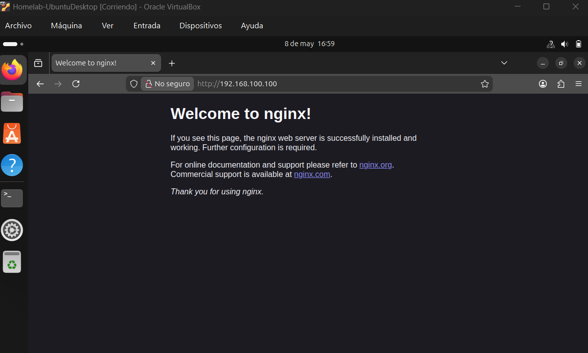
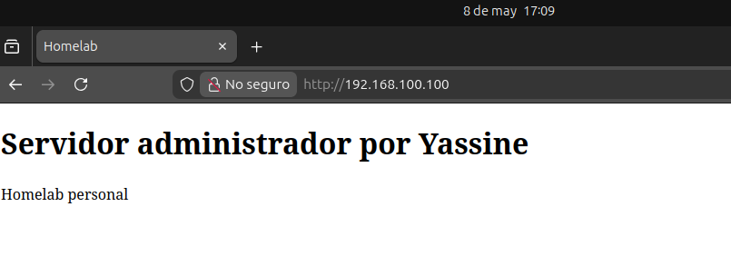

# Fase 2 — Servicios web

**Objetivo:** Implementación de un servidor web con virtualhost propio

**Instalar Nginx**
```
sudo apt install nginx -y
sudo systemctl enable nginx
sudo systemctl start nginx
sudo systemctl status nginx
```

Al abrir el navegador de UbuntuDesktop y entrar a `http://192.168.100.100` — podemos ver la página de bienvenida de Nginx.


**Crear web**
```
# Crea el directorio para la web
sudo mkdir -p /var/www/miservidor/html
sudo chown -R $USER:$USER /var/www/miservidor/html

# Crear una página simple
nano /var/www/miservidor/html/index.html
```
```html
<!DOCTYPE html>
<html>
  <head><title>Homelab</title></head>
  <body>
    <h1>Servidor administrado por Yassine</h1>
    <p>Homelab personal</p>
  </body>
</html>
```

**Configurar virtualhost**
```
sudo nano /etc/nginx/sites-available/homelab
```
```
server {
    listen 80;
    server_name 192.168.100.100;
    root /var/www/homelab/html;
    index index.html;
    location / {
        try_files $uri $uri/ =404;
    }
}
```

```
sudo ln -s /etc/nginx/sites-available/homelab /etc/nginx/sites-enabled/
sudo nginx -t        # Verifica que la config no tiene errores
sudo systemctl reload nginx
```


**Checkpoint**
- La web es accesible desde `http://192.168.100.100`
- `nginx -t` no muestra errores
- El servicio está habilitado para arrancar con el sistema
