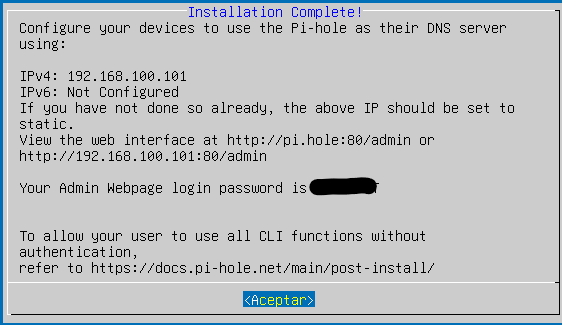
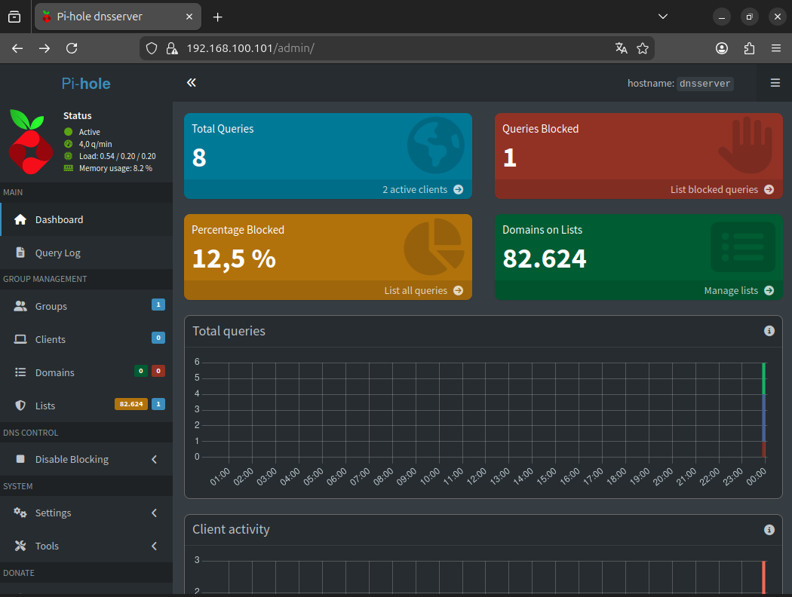

# Fase 3 - DNS local con Pi-hole

**Objetivo:** Implementar un servidor DNS local con bloqueo de publicidad mediante Pi-hole en una maquina virtual independiente.

---

## Creacion de la segunda maquina virtual

| Parametro | Valor |
|-----------|-------|
| Nombre | Homelab-DNS |
| OS | Ubuntu Server 24.04 LTS |
| RAM | 2048 MB |
| Disco | 30 GB (VDI, dinamico) |
| Red | Red NAT "homelab" |
| IP estatica | 192.168.100.101 |

---

## Instalacion de Ubuntu Server

Instalacion estandar con las siguientes opciones:

| Paso | Seleccion |
|------|-----------|
| Idioma | English |
| Keyboard | Spanish |
| Network | DHCP (configurar posteriormente) |
| Proxy | Vacío |
| Mirror | Por defecto |
| Storage | Por defecto |
| Nombre equipo | `dnsserver` |
| Usuario | `yassine` |
| SSH | Instalar OpenSSH Server |
| Featured snaps | Ninguno |

---

## Configuracion de IP estatica

Iniciar sesion con el usuario `yassine`.

```bash
# Ver nombre de la interfaz
ip a
```

Editar configuracion de Netplan:

```bash
sudo nano /etc/netplan/50-cloud-init.yaml
```

```yaml
network:
  version: 2
  ethernets:
    enp0s3:
      dhcp4: false
      addresses:
        - 192.168.100.101/24
      routes:
        - to: default
          via: 192.168.100.1
      nameservers:
        addresses: [8.8.8.8, 1.1.1.1]
```

```bash
# Aplicar configuracion
sudo netplan apply

# Verificar IP
ip a | grep 192.168.100.101
```

---

## Instalacion de Pi-hole

```bash
# Actualizar sistema
sudo apt update && sudo apt upgrade -y

# Instalar dependencias
sudo apt install curl -y

# Ejecutar instalador
curl -sSL https://install.pi-hole.net | bash
```

### Guia interactiva de instalacion

| Pantalla | Accion |
|----------|--------|
| Bienvenida | OK (Enter) |
| Confirmar IP estatica | Verificar que muestra 192.168.100.101 -> OK |
| Upstream DNS | Elegir Google (anycast) o Cloudflare |
| Listas de bloqueo | Dejar por defecto (StevenBlack) |
| IPv4/IPv6 | Seleccionar IPv4, deseleccionar IPv6 |
| Web admin interface | Seleccionar SI |
| Admin web interface | Dejar en ON |
| Log queries | Seleccionar SI |
| Privacy mode | 0 (mostrar todo) |

**Importante:** Al final de la instalacion aparece una contraseña temporal. Copiarla o anotarla:

```
[✓] Web Interface password: XXXXXXXX
```


---

```bash
sudo pihole setpassword
```

El sistema solicitara escribir la nueva contraseña dos veces.


## Acceso al panel web

Desde el navegador de Ubuntu Desktop:

```
http://192.168.100.101/admin
```

- Usuario: (dejar vacio)
- Contraseña: la proporcionada durante la instalacion



```


---

## Comandos utiles de administracion

| Comando | Funcion |
|---------|---------|
| `pihole -c` | Ver dashboard en terminal |
| `pihole -g` | Actualizar listas de bloqueo |
| `pihole -t` | Ver log de consultas en tiempo real |
| `pihole -up` | Actualizar Pi-hole |
| `pihole restartdns` | Reiniciar servicio DNS |
| `pihole setpassword` | Cambiar contraseña del panel |

---

## Checklist de verificacion

- [ ] La VM DNS tiene IP 192.168.100.101
- [ ] El panel de Pi-hole es accesible en http://192.168.100.101/admin
- [ ] La contraseña del panel ha sido cambiada

---

## Solucion de problemas

| Problema | Solucion |
|----------|----------|
| No se accede al panel web | `sudo systemctl status pihole-FTL` |
| La IP fija no se aplica | Verificar interfaz con `ip a` y ajustar YAML |
| No resuelve DNS | `pihole restartdns` |
| Se olvido la contraseña | `sudo pihole setpassword` |
| El bloqueo no funciona | `pihole -g` (actualizar listas) |

---

## Evidencias para documentacion

Guardar estas capturas en el directorio `/capturas`:

| Captura | Nombre sugerido |
|---------|-----------------|
| Pi-hole instalado | `31-pihole-instalado.png` |
| Pantalla Pi-hole | `32-webadmin-inicial.png` |


---

**Autor:** Yassine Elouakili
**Fecha:** 2026-05-13
**Estado:** Fase en curso
```