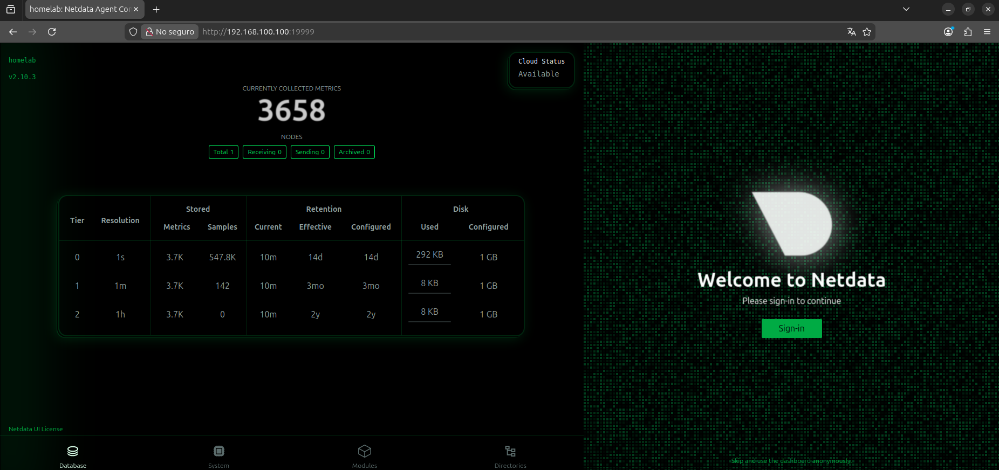

# Fase 3 - Monitorización con Netdata

**Objetivo:** Implementar un sistema de monitorización de recursos y red del sistema.

## Instalar Netdata

```
## En el servidor principal (Homelab-UbuntuServer) (192.168.100.100)
bash <(curl -Ss https://get.netdata.cloud/kickstart.sh) --stable-channel
```
---

**Acceder a la web desde PC**: `http://192.168.100.100:19999`
Aqui se puede ver en tiempo real: CPU, RAM, disco, red, y los procesos del sistema incluyendo Nginx.



---

## Configurar una alerta básica de disco

```
sudo nano /etc/netdata/health.d/disco.conf
```
```
alarm: disco_casi_lleno
on: disk.space
lookup: average -10m unaligned of used
units: %
every: 1m
warn: $this > 80
crit: $this > 90
info: El disco está casi lleno
```
```
sudo systemctl restart netdata
```

Esta alerta aparece cuando el espacio del disco ha superado el 90%.

---

**Checkpoint fase 4**
- Dashboard de Netdata accesible y mostrando métricas en vivo
- Alerta de disco configurada

---

## Solucion de problemas

| Problema | Solucion |
|----------|----------|
| No se accede al panel web | `sudo ufw allow 19999/tcp` |
| La IP fija no se aplica | Verificar interfaz con `ip a` y ajustar YAML |
| No resuelve DNS | `pihole restartdns` |
| Se olvido la contraseña | `sudo pihole setpassword` |
| El bloqueo no funciona | `pihole -g` (actualizar listas) |